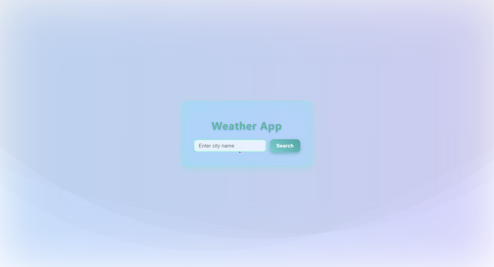
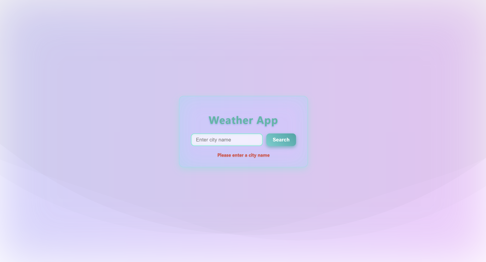
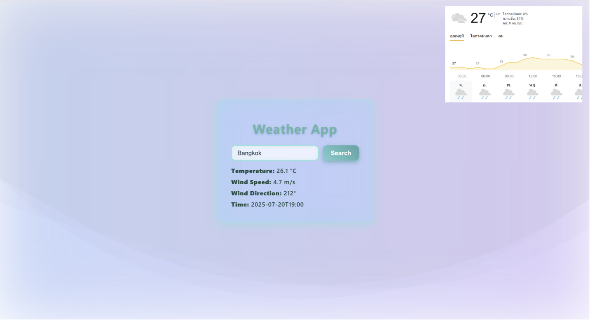
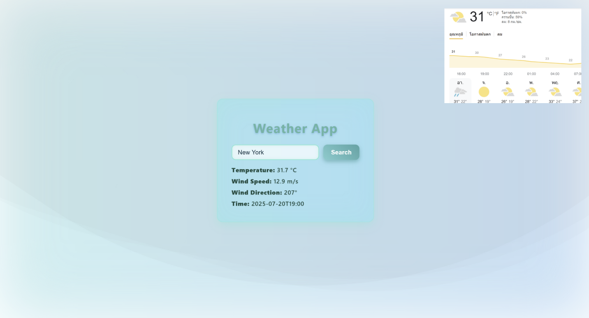

# WeatherApp 🌤️

A modern weather application built with [Angular 20.1.1](https://angular.io).  
It features real-time weather search by city, smooth animations, and a clean, responsive design.

[](https://angular.io)
[](https://opensource.org/licenses/MIT)

---

## 🔍 Features

- 🌍 Search current weather by city name
- ✨ Beautiful animated UI with gradient background
- ⚡ Loading spinner & error handling
- 💨 Displays temperature, windspeed, wind direction, and time

---

## 🚀 Getting Started

Install dependencies and start the development server:

```bash
npm install
ng serve
Open your browser at: http://localhost:4200
```

## 📸 Screenshots

| Home | Error | Success | Success |
|------|---------|---------|-------|
|  |  |  |  |
